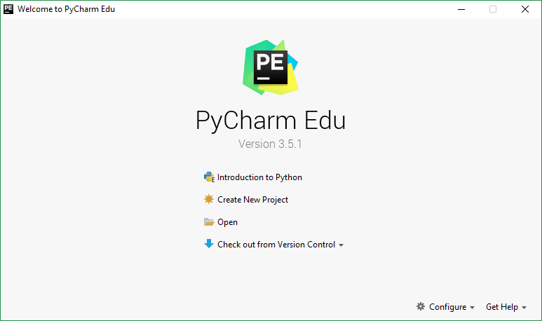
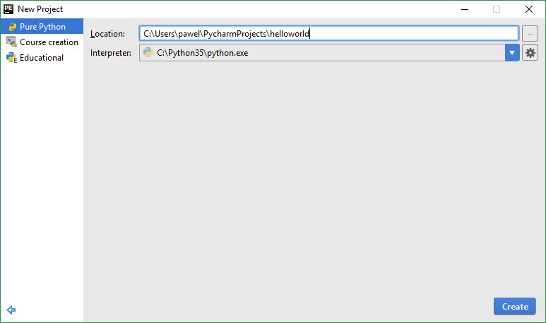
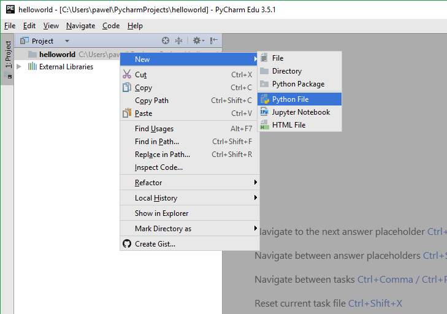
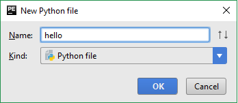
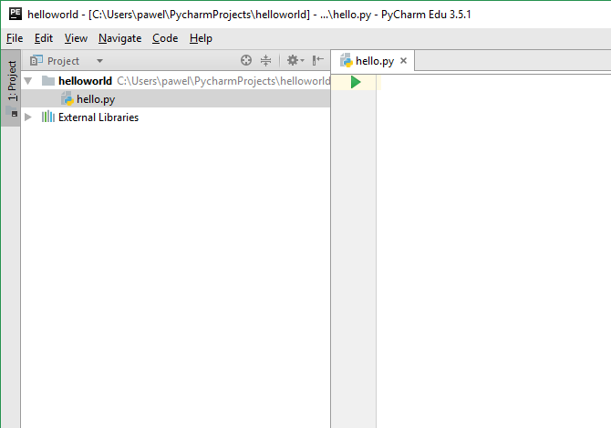
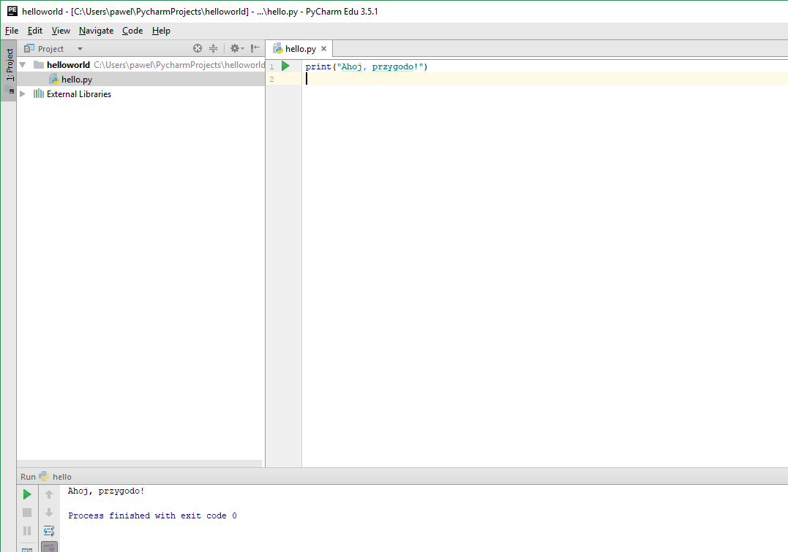
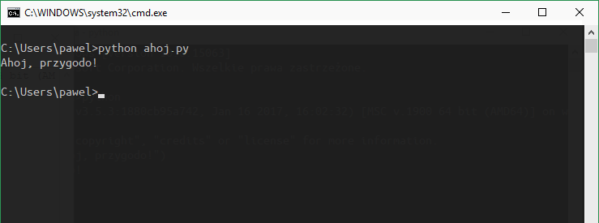

# Pierwsze kroki

Nauczymy się teraz uruchamiać w Pythonie tradycyjny program „Ahoj, przygodo!”. Dzięki temu nauczysz się pisać, zapisywać i uruchamiać programy Pythona.

Są dwa sposoby używania Pythona do uruchamiania programów: użycie linii poleceń interpretera lub użycie pliku źródłowego. Zobaczmy, w jaki sposób korzystać z tych metod.

## Używanie linii poleceń interpretera

Uruchom interpreter Pythona, wpisując `python` w powłoce (ang. shell) systemowej (jak opisano wcześniej w rodziale [Instalacja](./03.md#instalacja))

Po uruchomieniu powinieneś zobaczyć `>>>`, gdzie możesz wpisywać komendy. To jest znak interpretera Pythona.

Teraz wpisz `print('Ahoj, przygodo!')` i wciśnij `Enter`. Na ekranie powinien pojawić się napis `Ahoj, przygodo!`.

Tu jest przykład co możesz zobaczyć, używając komputera z systemem Windows 10. Detale mogą się różnić na twoim komputerze, ale część (od znaku `>>>`) powinna być niezmienna bez względu na system operacyjny.

```
Python 3.5.3 (v3.5.3:1880cb95a742, Jan 16 2017, 16:02:32) [MSC v.1900 64 bit (AMD64)] on win32
Type "help", "copyright", "credits" or "license" for more information.
>>> print("Ahoj, przygodo!")
Ahoj, przygodo!
>>>
```

Zobacz, Python natychmiast zwraca wynik! To, co właśnie wprowadziłeś, to pojedyncze *polecenie* Pythona. Używamy `print` (ang. drukuj, wypisz), aby wypisać to, co mu podamy. W naszym przypadku podaliśmy tekst `Ahoj, przygodo!` i został on natychmiast wyświetlony na ekranie.

### Jak wyjść z interpretera?

Jeśli używasz Pythona w linii poleceń Windows, naciśnij `[ctrl + z]`, a następnie `[enter]`.

Jeśli używasz IDLE bądź powłoki systemowej Linuksa/BSD/Mac OS X, wciśnij po prostu `[ctrl + d]` albo wpisując `exit()` (pamiętajaby dopisać nawiasy na końcu `()`) a następnie naciśnij klawisz `[enter]`.

## Wybór edytora

Zanim nauczymy się pisać programy Pythona w plikach, potrzebny nam będzie edytor, by te pliki zapisywać. Wybór odpowiedniego edytora jest bardzo ważny. Wybierz edytor tak starannie, jakbyś wybierał nowy samochód do kupienia. Dobry edytor pomoże Ci łatwo pisać programy i sprawi, że Twoja podróż będzie przyjemniejsza i pomoże Ci dotrzeć do pożądanego celu w szybszy i bezpieczniejszy sposób.

Jednym z najbardziej podstawowych wymogów jest _podświetlanie składni_, dzięki czemu różne fragmenty programu oznaczane są innym kolorem, co znacznie poprawia czytelność kodu i pozwala _wyobrazić_ sobie działanie programu.

Jeśli nie masz pojęcia gdzie zacząć, polecam używanie programu [PyCharm Wersja Edukacyjna](https://www.jetbrains.com/pycharm-edu/), dostępnego na Windows, Mac OS X i GNU/Linux. Szczegóły w następnej sekcji.

W szczególności proszę *nie korzystać z Notatnika*! To zły wybór, ponieważ nie ma podświetlania składni i — co równie ważne — nie wspiera wcięć w kodzie programu, a, jak się przekonasz, w Pythonie jest to szczególnie ważne.

Doświadczeni programiści z pewnością już znają i używają Vima lub Emacsa. [Vim](http://www.vim.org/) i [Emacs](http://www.gnu.org/software/emacs/emacs.html) to dwa najpotężniejsze edytory, jakie są dostępne dla programistów. Można ich używać na każdej znanej platformie: Windows, Mac OS X, Linux, BSD. Jeśli zamierzasz pisać dużo kodu w Pythonie, zalecam nauczenie się któregoś z nich, ponieważ bardzo usprawniają pracę. Ich dobre opanowanie może zająć więcej czasu, ale na dłuższą metę procentuje.

Jeśli nadal czujesz się nienasycony liczbą możliwości, przejrzyj [listę edytorów Pythona](https://wiki.python.org/moin/PythonEditors).

Powtórzę raz jeszcze: wybierz porządny edytor — pisanie programów będzie znacznie przyjemniejsze i łatwiejsze.

## PyCharm {#pycharm}

[PyCharm Wersja Edukacyjna](https://www.jetbrains.com/pycharm-edu/) to darmowy edytor do pisania programów w Pythonie.

Gdy otworzysz Pycharm, wybierz w nim opcję `Create New Project`:



Zmień `untitled` na `helloworld` jako nazwę projektu, powinieneś widzieć detale podobne do:



Kliknij na `Create`.

Prawym przyciskiem myszki kliknij na `helloworld` i wybierz `New` -> `Python File`:



Gdy zostaniesz zapytany o wpisanie nazwy, wpisz `hello`:



Zobaczysz nowy plik otworzony dla ciebie:



Wpisz:

```python
print("Ahoj, przygodo!")
```
Teraz naciśnij zieloną strzałkę, lub skrót na klawiaturze `Shift+F10` i powinieneś zobaczyć:



Więcej informacji o programie PyCharm jest w oficjalnym tutorialu [PyCharm Quickstart](https://www.jetbrains.com/pycharm-educational/quickstart/).

## Vim

1. Zainstaluj [Vim](http://www.vim.org)
    * Użytkownicy Mac OS X powinni zainstalować pakiet `macvim` przez [HomeBrew](http://brew.sh/)
    * Użytkonicy Windows powinni ściągnąć instalator ze [strony Vim](http://www.vim.org/download.php)
    * Użytkownicy GNU/Linux powinni zainstalować używając oficjalnych repozytoriów, dla użytkowników Ubuntu jest to pakiet `vim`.
2. Zainstaluj plugin [jedi-vim](https://github.com/davidhalter/jedi-vim) aby mieć .
3. Zainstaluj paczkę `jedi` używając: `pip install -U jedi`

## Emacs

1. Zainstaluj [Emacs 24+](http://www.gnu.org/software/emacs/).
    * Użytkownicy Mac OS X powinni ściągnąć Emacs z http://emacsformacosx.com
    * Użytkownicy Windows powinni ściągnąć Emacs z http://ftp.gnu.org/gnu/emacs/windows/
    * Użytkownicy GNU/Linux powinni zainstalować używając oficjalnych repozytoriów, dla użytkowników Ubuntu jest to pakiet `emacs24`.
2. Zainstaluj [ELPY](https://github.com/jorgenschaefer/elpy/wiki)

## Używanie plików źródłowych

Wróćmy wreszcie do programowania. Jest taka tradycja, że za każdym razem, kiedy uczysz się nowego języka programowania, pierwszym programem jest „Ahoj, przygodo!” (w oryginale „Hello World”) — wszystko, co robi, to tylko wypisanie tekstu „Ahoj, przygodo!”. Jak mówi Simon Cozens (autor świetnej książki pt. „Perl. Od podstaw”), jest to tradycyjna inkantacja do bogów programowania, by pozwolili Ci lepiej nauczyć się języka :) .

Jeśli używasz PyCharm, [zostało to przedstawione wyżej](#pycharm).

Uruchom Twój edytor, wpisz poniższy program i zapisz go pod nazwą `ahoj.py`.

WAŻNE: Upewnij się, że rozszerzenie twojego pliku to `.py`, np. `foo.py`.

Uruchom program, otwierając powłokę, przechodząc do odpowiedniego katalogu i wykonując w nim polecenie `python ahoj.py` (w środowisku Linux użyj `python3`).

Wynik powinien przypominać:

```
$ python ahoj.py
Ahoj, przygodo!
```



Jeśli wynik w istocie przypomina powyższy, gratulacje! Właśnie uruchomiłeś swój pierwszy program w Pythonie.

Jeśli wystąpił błąd, przepisz program *dokładnie* tak, jak powyżej i spróbuj uruchomić go jeszcze raz. Zauważ, że Python rozróżnia wielkość liter, np. `print` znaczy co innego, niż `Print` (zauważ wielkie `P` w drugim). Upewnij się także, że nie ma żadnych spacji ani też znaków tabulacji na początku którejś linii (później przekonamy się, dlaczego jest to takie jest istotne).


**Jak to działa**

W naszym pierwszym programie po komentarzach następuje *polecenie* Pythona, które wypisuje na ekran słowa `Ahoj, przygodo!`. Polecenie `print` jest *instrukcją*, a dostarczony przez nas napis `Ahoj, przygodo!` jest łańcuchem (ang.string — ciągiem znaków).

## Uzyskiwanie pomocy

Jeśli potrzebujesz szybkiej informacji o jakiejś funkcji lub poleceniu Pythona, możesz skorzystać z wbudowanej pomocy. Przydaje się to szczególnie podczas używania wiersza poleceń interpretera. Dla przykładu możesz wykonać `help(str)`, a uzyskasz pomoc odnośnie klasy `str`, obsługującej w Pythonie łańcuchy (tekst), której możesz użyć w swoim programie (klasy będą omówione dokładnie w innym rozdziale).

Uwaga
Aby wyjść z pomocy, wciśnij `q`.

W podobny sposób możesz uzyskać informacje na temat niemal wszystkiego, co dotyczy Pythona. By dowiedzieć się więcej o samej pomocy, użyj `help()`.

Zauważ, że musimy użyć cudzysłowu do oznaczenia `'print'`, żeby Python wiedział, że chcemy uzyskać pomoc na temat instrukcji `print`, a nie coś wypisywać.


## Podsumowanie

Pisanie, zapisywanie i uruchamianie programów w Pythonie nie powinno Ci już sprawiać żadnych trudności.

Skoro już umiemy posługiwać się Pythonem, poznajmy więcej koncepcji dotyczących tego języka.
